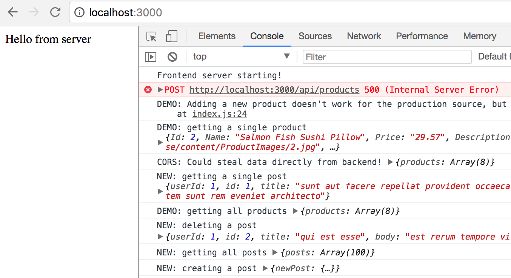
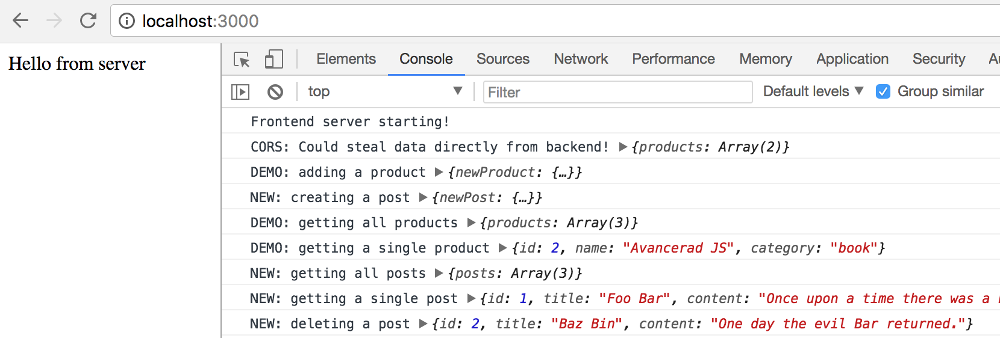

Mandatory exercise 1
==================

**The deadline for this exercise is Monday April XX, 23.59.**

For this **mandatory exercise 1** your should work on **master branch only**.

### Preparation

1. Create a new repository on [Github](github.com) called **mandatory-express**

2. Follow the instructions that Github gives you; create a local repository and add a remote or clone
the recently created repository.

### Submission

When you do the submission of your exercise in Ping Pong, **before the deadline**,
you will enter the link to your repository, such as:

```
https://github.com/mygithubusername/mandatory-express
```

The teacher will look in the **master branch**. If any commits are done to the master branch after the deadline, the grade IG will follow.

You will either get **G** or **IG** on the mandatory exercises.


### The mission

In this exercise you will do **two things**:

  1. add new functionality to an already functioning app.
  2. implement CORS support


### The pre-existing functionality

The backend server, defined in `project/src/server/index.js`, already has a bunch of routes defined in `project/src/server/routes/product.js`. Each route uses a method on the `store`. The store uses an `EdumentSource` or `MockSource` depending on whether we're in development or production mode.

  * GET `/products` to get a list of all products, uses `.getProducts()` on the store
  * GET `/products/:id` to get info on a specific product, uses `.getProduct(id)` on the store
  * POST `/products` to add a new product, uses `.addProduct(newProduct)` on the store

The production mode of the store, using `EdumentSource`, utilizes a "real" API at `http://demo.edument.se/api/`. While the `MockSource` simply uses in-memory bogus test data.

### Running the app

1. Navigate to the `project` folder in a terminal
1. Do `npm install` if you haven't already
1. Fire up the backend server by doing `npm run start-development` or `npm run start-production`
1. Open a second terminal window/tab and navigate to the same folder
1. Start a local webserver to serve the frontend by doing `npm run start`
1. Go to `localhost:3000` in the browser! The "frontend", defined in `project/src/client/index.js`, is super-skinny, it just logs out some stuff to the console, so you need to open the dev tools to see anything useful at all.
1. Both servers will restart automatically whenever you save a file that they're using
1. Use of `console.log`...
  * in the frontend code can be seen in the devtools in the browser
  * in the backend server code will output to the terminal window where it is running

### Mission 1: Adding new functionality

Your first mission is to **add a new routes module** to live alongside the already existing `product.js`! Create a new file next to it called **`posts.js`**! This module should add routes to...

  * get all posts
  * get a single post
  * add a new post (this should return the added post)
  * delete a post (this should return the deleted post)

For each new route you need to...

  * **add a production version of the method** to `EdumentSource`. This should use the corresponding API from [https://jsonplaceholder.typicode.com/](https://jsonplaceholder.typicode.com/).
  * **add a development version of the method** to `MockSource`.
  * **register the method** in `project/src/server/routes/index.js` to make the server actually use them.

You don't need to change any existing functionality, so you can leave the product-related code alone!

To test your code, add new hard-coded `fetch` calls inside `project/src/client/index.js`. This code should log out the responses from the server, showing that the new functionality is working.

Remember that you must test both the development and the production version!

### Mission 2: Implement CORS support

In `src/client/index.js` you might have noticed this code at the very bottom:

```
fetch('http://localhost:8888/api/products')
  .then(response => response.json())
  .then(products => console.log("Could steal data directly from backend!", products))
  .catch(e => console.log("Failed to call backend directly :(", e));
```

When you run the app, you'll see that it `"Failed to call backend directly :("`. This is because the client code was served from `http://localhost:3000`, and normally a server will deny requests coming from code that it didn't serve itself. So since `http://localhost:3000` is different from `http://localhost:8888`, the request is denied.

Your second job for the day is to add CORS support to the backend server! This means hacking `project/src/server/server.js` to use the [CORS express middleware](https://expressjs.com/en/resources/middleware/cors.html). Follow that link for instructions on how to install and use the module!

When you're successful, you should see `"Could steal data directly from backend!"` being logged out!

### When you're all done

When all of the above is completed, the output in the console when running a production server should look something like this:



The error isn't your fault, it is caused by the demo code to add a new product, which doesn't actually work. The call is only there to help you make the new call.

For the development server, you should see something like this:


